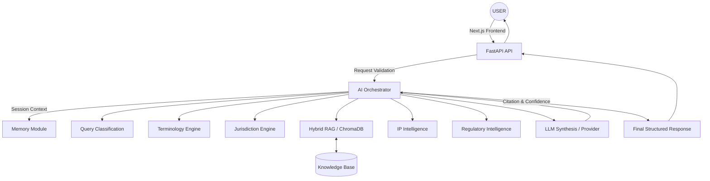

# AYURLEX Architecture & Feature Matrix

## Feature Matrix

| Feature | Status | Notes |
|---------|--------|-------|
| Frontend Shell (Next.js) | IMPLEMENTED | Botanical dark theme |
| FastAPI Backend | IMPLEMENTED | REST API running |
| SQLite Database | IMPLEMENTED | Schema defined in models.py |
| Document Upload | IMPLEMENTED | /api/documents/upload |
| Chroma RAG | IMPLEMENTED | Local PersistentClient |
| Citation Engine | IMPLEMENTED | Output generated by Orchestrator |
| Terminology Engine | IMPLEMENTED | Seed data for Ashwagandha, Turmeric |
| Jurisdiction Engine | IMPLEMENTED | Seed logic for India/US |
| IP Intelligence | IMPLEMENTED | Prototype logic handling patent overlaps |
| Regulatory Intelligence | IMPLEMENTED | Prototype logic for Ayush acts |
| Confidence & Evidence Gaps | IMPLEMENTED | Propagated via structured JSON response |
| Research Mode | IMPLEMENTED | Animated steps shown on UI |
| Evaluation Dataset | IMPLEMENTED | evaluate.py script |
| Government Demo Scenarios | IMPLEMENTED | README outlines how to run |
| PDF Analysis | PARTIAL | Prototype simulates text extraction, upload works |
| Deployment Instructions | IMPLEMENTED | See deployment.md |
| PostgreSQL Migration | PLANNED | V1.1 roadmap |

## System Architecture Diagram

## V1.1 Roadmap
1. Migration to PostgreSQL and Managed Vector Database
2. Full PDF OCR and parsing pipeline
3. Multi-language embeddings for all 16 languages
4. Production-grade authentication
